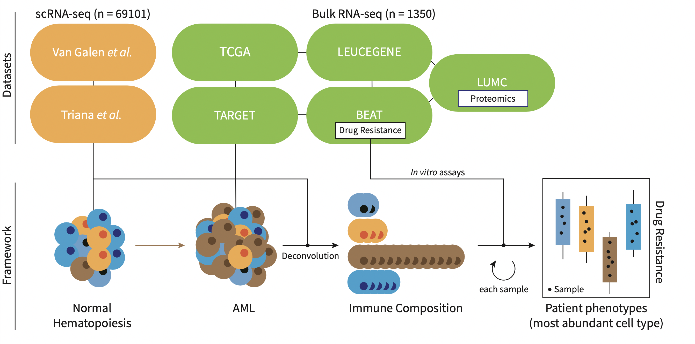

## Overview
`seAMLess` is a wrapper function which deconvolutes bulk Acute Myeloid Leukemia (AML) RNA-seq samples with a healthy single cell reference atlas.



## Installation
To get bug fix and use a feature from the development version: 
```{r, eval=FALSE}
# install.packages("devtools")
devtools::install_github("eonurk/seAMLess")
```

## Usage
```{r warning=FALSE, message=FALSE}
library(seAMLess)
library(xbioc) # required

data(exampleTCGA)
head(exampleTCGA)[,1:4]
```


```{r warning=FALSE}
# Now run the function
res <- seAMLess(exampleTCGA)

# AML deconvolution
head(res$Deconvolution)[,1:4]
```

```{r message=FALSE}
# Create ternary plot
ternaryPlot(res)
```

```{r}
# Venetoclax resistance
res$Venetoclax.resistance[1:4]
```


## Contribution
You can send pull requests to make your contributions.

## Author

- [E Onur Karakaslar](https://eonurk.github.io/)

## License

- GNU General Public License v3.0
